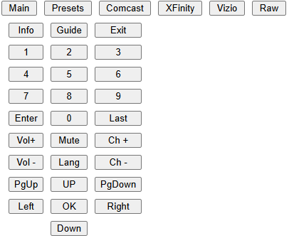
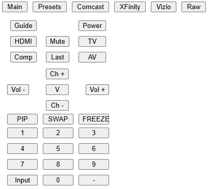
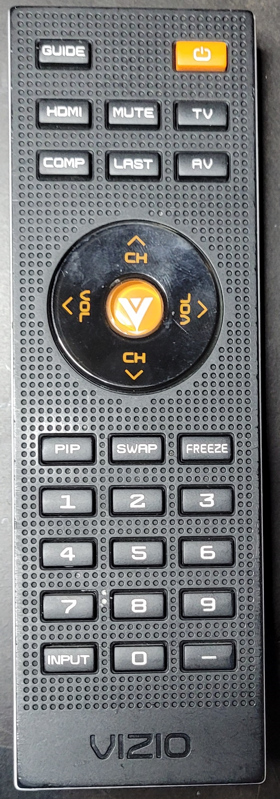
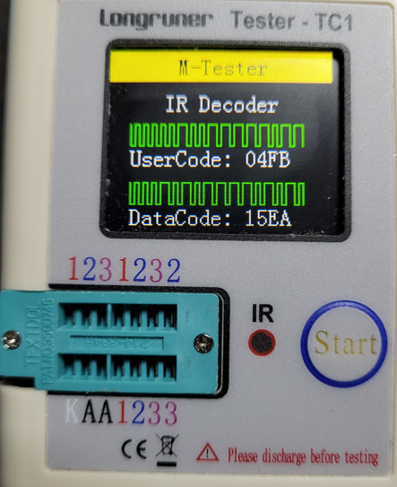
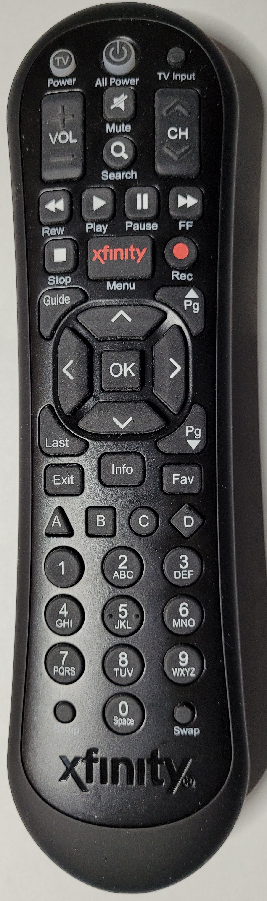
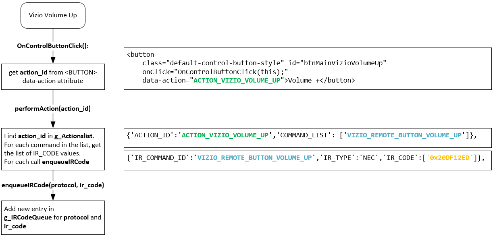

# Comcast / XFinity + Vizio Remote

This project is a basic Remote Emulator style of gimmick.

When powered up, it attempts to connect to a known WIFI AP (or falls back to
a secondary if first one not found...this is just a peculiarity of my
environment).

Once powered up and connected to WIFI, it can then send/receive HTTP traffic via [ESP8266WebServer](https://github.com/esp8266/Arduino/tree/master/libraries/ESP8266WebServer) functionality.

The main function of the code is to receive POSTs that contain IR Code
details (IR Protocol and IR Code), and then emit the codes via the IR LEDs 
(ESP8266 Pins D1, D2), using the IR Send functionality of [IRremoteESP8266](https://github.com/crankyoldgit/IRremoteESP8266/)
library.

Although the project provides a default web experience when connecting to
the device IP address, it's not necessary to load the HTML/CSS/Script
from the device, you can roll your own HTML or HTTP solution and host
elsewhere, as long as it can 'see' this device IP and create and send the
POSTs.

POSTs are a simple format of:
```
{ 'IR_PROTOCOL' : 'NEC', 'IR_CODE' : '0x20DF10EF' }
{ 'IR_PROTOCOL' : 'XMP', 'IR_CODE' : '0x170F443E19000600' }
{ 'IR_PROTOCOL' : 'XMP', 'IR_CODE' : '0x170F443E17002600' }
```

That first value is the Vizio remote POWER button **0x20DF10EF** which is an NEC protocol code, second and third are sending XMP protocol codes for Comast/XFinity remote control buttons "6" and "Info" respectively.

With the device processing this simple payload, it opens up a wide variety
of scenarios, driven by whatever creates and sends the POSTs.

Lots of comments in the code, for the curious.

## Purpose of this Project
I have 1 cable box at the far end of the house near the main TV.  I split the signal from the cable adapter output and run coax to my office at the other end of the house to a second TV.  This project allows me to change the channel (and control the TV) from the browser, from anywhere I have NAT access (mainly, in the room at the other end of the house)

Basically laid out like this:<br>


The UI is a no frills HTML/JS/CSS SPA and mimics all the buttons on the remote controls as well as provides a set of presets and a crude manual entry section that allows for experimentation.

Comcast Buttons:<br>


Vizio TV Buttons:<br>


XFinity XR2 Buttons:<br>


Presets are just a group of buttons representing various channels (TV and Music):<br>


### Raw Entry Section
This section allows manual entry of protocols and codes, and for 'scripting' or creation of a sequence of codes with some basic functionality like **DELAY** and **DELAY_UNTIL_DATE_TIME**

The following snip shows a sequence that waits until a certain date/time has elapsed, then sends 1197[enter], waits 5 seconds, sends 28[enter], waits another 5 seconds, and finally sends 4[enter].<br>


Mainly this just shows the possibility of creating more complicated scenarios.

# ESP8266
Device is a run of the mill ESP8266 with WIFI (platform: espressif8266)

<br>
D1 and D2 are connected to the anodes of the 5mm 940nm IR LEDs (purchased from https://www.adafruit.com/product/388)

This picture is just a simple test rig, the actual setup I have deployed has the LEDs soldered to a couple of perf boards at the end of long wires, that enable affixing near the devices.  No pictures of that mess.  It's Crude and I may revisit later, but for now works perfectly...which means I'll never 'fix' it :o)

With the [ESP8266IRRecord](https://github.com/MrJimmo/ESP8266IRRecord/tree/main) board listening, this made for quick test and development.

# Remote Controls

## Vizio TV Remote


Remote for TV Model: VO32L HDTV10A

TV Part #: 10223050022
...yeah, super old TV from 2008, but it's still alive and doing fine :o)


The table below contains the values I captured with the [ESP8266IRRecord](https://github.com/MrJimmo/ESP8266IRRecord/tree/main) project.

Luckily, I captured these a long time ago as corrosion has since killed the #6 button and the remote is mostly falling apart now after being dropped many times.

The Binary and Byte columns of the table were part of me doing some early learning about IR codes as they were read.

I split out the binary values for the number buttons (Button_0, Button_1, etc.) to see how they are constructed.

### IR Code Rabbit Hole
With the #6 button dying on me, it made me wonder; Could I figure out how to construct the Button_6 code **manually**? ...and that lead down a confusing rabbit hole.

Pressing all the number buttons on the control in 0 to 9 order, IR Recv library outputs:
|Button|NEC Code|Address|Command|
|-|-|-|-|
|BUTTON_0|0x20DF08F7|0x04FB|0x10EF|
|BUTTON_1|0x20DF8877|0x04FB|0x11EE|
|BUTTON_2|0x20DF48B7|0x04FB|0x12ED|
|BUTTON_3|0x20DFC837|0x04FB|0x13EC|
|BUTTON_4|0x20DF28D7|0x04FB|0x14EB|
|BUTTON_5|0x20DFA857|0x04FB|0x15EA|
|BUTTON_6|0x20DF6897|0x04FB|0x16E9|
|BUTTON_7|0x20DFE817|0x04FB|0x17E8|
|BUTTON_8|0x20DF18E7|0x04FB|0x18E7|
|BUTTON_9|0x20DF9867|0x04FB|0x19E6|

In this table form, I can see that Command codes follow a sequential pattern for buttons 0-9:<Br>
Button_0 == 0x10EF<br>
Button_1 == 0x11EE<br>
...<br>
Button_9 == 0x19E6<br>

But what is the deal with the NEC Code? Ex. Button 5:  0x20DFA857, the Address is 0x4FB and the Command is 0x15EA?

Turns out, they are related in an interesting way.

The NEC Value, if you look at it as a sequence of binary values left-to-right, it represents the pulse timings that are emitted by the IR LEDs of the remote controls.

Here's the power button for this Vizio remote, after graphing the pulse times and just eyeballing the 0's and 1's:<br>
<br>
_(I connected one of those cheap 8-ch logic analyzers to the remotes IR LED and used Pulseview to grab the values, and excel to plot the graph, mspaint for the extra annotations)_

That graph is for NEC Vizio Power button value 0x20DF10EF, which as binary is: `00100000 11011111 00010000 11101111`<br>
_(I wish I had done the graphing for button 5 to keep this text cohesive, but hopefully Power button pulse sequence still useful as an example)_

Now for Button 5, the NEC code is: 0x20DFA857<br>
As binary: `00100000 11011111 10101000 01010111`

I learned something else at this point; The bit sequence shows the first 8 bits are then inverted in the next 8, and the 3rd grouping of 8-bits are followed by its inverted value.

This lines up with 0x20DF A857:<br>
Byte 1 0x20: 00100000<br>
Byte 2 0xDF: 11011111 (inverse of Byte1)

Byte 3 0xA8: 10101000<br>
Byte 4 0x57: 01010111 ...inverse of Byte 3<br>

It just means Byte 1 and 3 are the important ones as far as differentiating each button, and Bytes 2 and 4 are just their inversions.

But what are those Address and Command values?

I noticed that those were the values I'd see, when using one of those cheap, generic testers that can read NEC IR Codes. Here's what it shows when pressing button 5 on the Vizio remote:<br>


UserCode: 04FB<br>
DataCode: 15EA

Took me a bit of fumbling with the math to eventually figure out:<br>
Byte 1 0x20 reversed: 00000100 == 0x04<br>
Byte 2 0xDF reversed: 11111011 == 0xFB<br>
Byte 3 0xA8 reversed: 00010101 == 0x15<br>
Byte 4 0x57 reversed: 11101010 == 0xEA<br>

So how does this help me figure out Button 6? (again, if I hadn't captured it long ago)

Well, given the sequential pattern is shown in Byte 3 (refer back to the table above), I just need to +1 to byte 3 and work backwards to the NEC Code.

The easy part: `0x15 + 0x01 == 0x16`

Inverting: `0x16 == !0x16 == 0xE9`

The Address is always the same: `0x04FB` (manufacturer code I think) and the calculated full command: `0x16E9`

But how to get the NEC code from this?

Simply work with Byte 1 and Byte 3, with Byte 2 and 4 being inversions of those respectively...<Br>
Byte 1: `0x04 == 00000100, reversed == 00100000 == 0x20`<br>
Byte 2: `!0x20 == 0xDF`<br>
Byte 3: `0x16 == 00010110, reversed == 01101000 == 0x68`<br>
Byte 4: `!0x68 == 0x97`<br>
And all together as the NEC code: `0x20DF6897` which is the Button 6 value from the table above.

NEC tech spec likely explains all this more clearly, but I worked on it from what I observed from the IR Recv library, the component tester, and the Logic Analyzer, which was actually a lot fun.

### IR Codes for Vizio Remote
|Button|Constant|Type|NEC|Binary|Byte1|Byte2|Byte3|Byte4|
|-|-|-|-|-|-|-|-|-|
|BUTTON_0|VIZIO_REMOTE_BUTTON_0|NEC|0x20DF08F7|00100000110111110000100011110111|00100000|11011111|00001000|11110111|
|BUTTON_1|VIZIO_REMOTE_BUTTON_1|NEC|0x20DF8877|00100000110111111000100001110111|00100000|11011111|10001000|01110111|
|BUTTON_2|VIZIO_REMOTE_BUTTON_2|NEC|0x20DF48B7|00100000110111110100100010110111|00100000|11011111|01001000|10110111|
|BUTTON_3|VIZIO_REMOTE_BUTTON_3|NEC|0x20DFC837|00100000110111111100100000110111|00100000|11011111|11001000|00110111|
|BUTTON_4|VIZIO_REMOTE_BUTTON_4|NEC|0x20DF28D7|00100000110111110010100011010111|00100000|11011111|00101000|11010111|
|BUTTON_5|VIZIO_REMOTE_BUTTON_5|NEC|0x20DFA857|00100000110111111010100001010111|00100000|11011111|10101000|01010111|
|BUTTON_6|VIZIO_REMOTE_BUTTON_6|NEC|0x20DF6897|00100000110111110110100010010111|00100000|11011111|01101000|10010111|
|BUTTON_7|VIZIO_REMOTE_BUTTON_7|NEC|0x20DFE817|00100000110111111110100000010111|00100000|11011111|11101000|00010111|
|BUTTON_8|VIZIO_REMOTE_BUTTON_8|NEC|0x20DF18E7|00100000110111110001100011100111|00100000|11011111|00011000|11100111|
|BUTTON_9|VIZIO_REMOTE_BUTTON_9|NEC|0x20DF9867|00100000110111111001100001100111|00100000|11011111|10011000|01100111|
|BUTTON_AV|VIZIO_REMOTE_BUTTON_AV|NEC|0x20DF8A75|00100000110111111000101001110101|00100000|11011111|10001010|01110101|
|BUTTON_V|VIZIO_REMOTE_BUTTON_V|NEC|0x20DFC23D|00100000110111111100001000111101|00100000|11011111|11000010|00111101|
|BUTTON_CHANNEL_DOWN|VIZIO_REMOTE_BUTTON_CHANNEL_DOWN|NEC|0x20DF629D|00100000110111110110001010011101|00100000|11011111|01100010|10011101|
|BUTTON_CHANNEL_UP|VIZIO_REMOTE_BUTTON_CHANNEL_UP|NEC|0x20DFA25D|00100000110111111010001001011101|00100000|11011111|10100010|01011101|
|BUTTON_COMP|VIZIO_REMOTE_BUTTON_COMP|NEC|0x20DF5AA5|00100000110111110101101010100101|00100000|11011111|01011010|10100101|
|BUTTON_DASH(-)|VIZIO_REMOTE_BUTTON_DASH(-)|NEC|0x20DFFF00|00100000110111111111111100000000|00100000|11011111|11111111|00000000|
|BUTTON_FREEZE|VIZIO_REMOTE_BUTTON_FREEZE|NEC|0x20DFA659|00100000110111111010011001011001|00100000|11011111|10100110|01011001|
|BUTTON_GUIDE|VIZIO_REMOTE_BUTTON_GUIDE|NEC|0x20DF38C7|00100000110111110011100011000111|00100000|11011111|00111000|11000111|
|BUTTON_HDMI|VIZIO_REMOTE_BUTTON_HDMI|NEC|0x20DF639C|00100000110111110110001110011100|00100000|11011111|01100011|10011100|
|BUTTON_INPUT|VIZIO_REMOTE_BUTTON_INPUT|NEC|0x20DFF40B|00100000110111111111010000001011|00100000|11011111|11110100|00001011|
|BUTTON_LAST|VIZIO_REMOTE_BUTTON_LAST|NEC|0x20DF58A7|00100000110111110101100010100111|00100000|11011111|01011000|10100111|
|BUTTON_MUTE|VIZIO_REMOTE_BUTTON_MUTE|NEC|0x20DF906F|00100000110111111001000001101111|00100000|11011111|10010000|01101111|
|BUTTON_PIP|VIZIO_REMOTE_BUTTON_PIP|NEC|0x20DF06F9|00100000110111110000011011111001|00100000|11011111|00000110|11111001|
|BUTTON_POWER|VIZIO_REMOTE_BUTTON_POWER|NEC|0x20DF10EF|00100000110111110001000011101111|00100000|11011111|00010000|11101111|
|BUTTON_SWAP|VIZIO_REMOTE_BUTTON_SWAP|NEC|0x20DF6699|00100000110111110110011010011001|00100000|11011111|01100110|10011001|
|BUTTON_TV|VIZIO_REMOTE_BUTTON_TV|NEC|0x20DF6B94|00100000110111110110101110010100|00100000|11011111|01101011|10010100|
|BUTTON_VOLUME_DOWN|VIZIO_REMOTE_BUTTON_VOLUME_DOWN|NEC|0x20DFE21D|00100000110111111110001000011101|00100000|11011111|11100010|00011101|
|BUTTON_VOLUME_UP|VIZIO_REMOTE_BUTTON_VOLUME_UP|NEC|0x20DF12ED|00100000110111110001001011101101|00100000|11011111|00010010|11101101|

### IR Codes for Vizio Remote (crazy table version)
During all this 'learning', I used Excel to futz around with all the values and ended up finding that there's no `=REVERSE()` function in Excel.

Surprisingly, CoPilot provided one when I asked `write an excel formula for reversing text`

It spit out the following:
`=TEXTJOIN("", TRUE, MID(A1, LEN(A1) + 1 - ROW(INDIRECT("1:" & LEN(A1))), 1))`

That's what I pasted into Byte1_REV, Byte2_REV, etc. columns, with slight change to the referenced cell and it worked exactly as I wanted. I do not fear this tech :o)

**Other column formulas**

Binary column function: `=CONCATENATE(HEX2BIN(MID(D2,3,2),8), HEX2BIN(MID(D2,5,2),8), HEX2BIN(MID(D2,7,2),8), HEX2BIN(MID(D2,9,2),8))` ...D2 is the NEC column.

Byte1: `=HEX2BIN(MID($D2,3,2),8)` ...D2 is anchored to the NEC column.<br>
Byte2: `=HEX2BIN(MID($D2,5,2),8)` ...notice the second param skips 2 chars.<br>
Byte2: `=HEX2BIN(MID($D2,7,2),8)` ...skips another 2<br>
Byte2: `=HEX2BIN(MID($D2,9,2),8)` ...and finally, the last 2 chars.<br>

_(Using CoPilot provided formula)_<br>
Byte1_Rev: `=TEXTJOIN("", TRUE, MID(F2, LEN(F2) + 1 - ROW(INDIRECT("1:" & LEN(F2))), 1))` ...F2 is Byte1 column<br>
Byte2_Rev: `=TEXTJOIN("", TRUE, MID(G2, LEN(G2) + 1 - ROW(INDIRECT("1:" & LEN(G2))), 1))` ...G2 is Byte2 column<br>
Byte3_Rev: `=TEXTJOIN("", TRUE, MID(H2, LEN(H2) + 1 - ROW(INDIRECT("1:" & LEN(H2))), 1))` ...H2 is Byte3 column<br>
Byte4_Rev: `=TEXTJOIN("", TRUE, MID(I2, LEN(I2) + 1 - ROW(INDIRECT("1:" & LEN(I2))), 1))` ...I2 is Byte4 column<br>

Byte1Hex: `=BIN2HEX(J2,2)` ...J2 is Byte1_REV column<br>
Byte2Hex: `=BIN2HEX(K2,2)` ...K2 is Byte2_REV column<br>
Byte3Hex: `=BIN2HEX(L2,2)` ...L2 is Byte3_REV column<br>
Byte4Hex: `=BIN2HEX(M2,2)` ...M2 is Byte4_REV column<br>

Address: `=CONCAT("0x",N2,O2)` ...N2,O2 are Byte1Hex and Byte2Hex<br>
Command: `=CONCAT("0x",P2,Q2)` ...P2,Q2 are Byte3Hex and Byte4Hex

|Button|Constant|Type|NEC|Binary|Byte1|Byte2|Byte3|Byte4|Byte1_REV|Byte2_REV|Byte3_REV|Byte4_REV|Byte1Hex|Byte2Hex|Byte3Hex|Byte4Hex||Address|Command|
|-|-|-|-|-|-|-|-|-|-|-|-|-|-|-|-|-|-|-|-|
|BUTTON_0|VIZIO_REMOTE_BUTTON_0|NEC|0x20DF08F7|00100000110111110000100011110111|00100000|11011111|00001000|11110111|00000100|11111011|00010000|11101111|04|FB|10|EF||0x04FB|0x10EF|
|BUTTON_1|VIZIO_REMOTE_BUTTON_1|NEC|0x20DF8877|00100000110111111000100001110111|00100000|11011111|10001000|01110111|00000100|11111011|00010001|11101110|04|FB|11|EE||0x04FB|0x11EE|
|BUTTON_2|VIZIO_REMOTE_BUTTON_2|NEC|0x20DF48B7|00100000110111110100100010110111|00100000|11011111|01001000|10110111|00000100|11111011|00010010|11101101|04|FB|12|ED||0x04FB|0x12ED|
|BUTTON_3|VIZIO_REMOTE_BUTTON_3|NEC|0x20DFC837|00100000110111111100100000110111|00100000|11011111|11001000|00110111|00000100|11111011|00010011|11101100|04|FB|13|EC||0x04FB|0x13EC|
|BUTTON_4|VIZIO_REMOTE_BUTTON_4|NEC|0x20DF28D7|00100000110111110010100011010111|00100000|11011111|00101000|11010111|00000100|11111011|00010100|11101011|04|FB|14|EB||0x04FB|0x14EB|
|BUTTON_5|VIZIO_REMOTE_BUTTON_5|NEC|0x20DFA857|00100000110111111010100001010111|00100000|11011111|10101000|01010111|00000100|11111011|00010101|11101010|04|FB|15|EA||0x04FB|0x15EA|
|BUTTON_6|VIZIO_REMOTE_BUTTON_6|NEC|0x20DF6897|00100000110111110110100010010111|00100000|11011111|01101000|10010111|00000100|11111011|00010110|11101001|04|FB|16|E9||0x04FB|0x16E9|
|BUTTON_7|VIZIO_REMOTE_BUTTON_7|NEC|0x20DFE817|00100000110111111110100000010111|00100000|11011111|11101000|00010111|00000100|11111011|00010111|11101000|04|FB|17|E8||0x04FB|0x17E8|
|BUTTON_8|VIZIO_REMOTE_BUTTON_8|NEC|0x20DF18E7|00100000110111110001100011100111|00100000|11011111|00011000|11100111|00000100|11111011|00011000|11100111|04|FB|18|E7||0x04FB|0x18E7|
|BUTTON_9|VIZIO_REMOTE_BUTTON_9|NEC|0x20DF9867|00100000110111111001100001100111|00100000|11011111|10011000|01100111|00000100|11111011|00011001|11100110|04|FB|19|E6||0x04FB|0x19E6|
|BUTTON_AV|VIZIO_REMOTE_BUTTON_AV|NEC|0x20DF8A75|00100000110111111000101001110101|00100000|11011111|10001010|01110101|00000100|11111011|01010001|10101110|04|FB|51|AE||0x04FB|0x51AE|
|BUTTON_V|VIZIO_REMOTE_BUTTON_V|NEC|0x20DFC23D|00100000110111111100001000111101|00100000|11011111|11000010|00111101|00000100|11111011|01000011|10111100|04|FB|43|BC||0x04FB|0x43BC|
|BUTTON_CHANNEL_DOWN|VIZIO_REMOTE_BUTTON_CHANNEL_DOWN|NEC|0x20DF629D|00100000110111110110001010011101|00100000|11011111|01100010|10011101|00000100|11111011|01000110|10111001|04|FB|46|B9||0x04FB|0x46B9|
|BUTTON_CHANNEL_UP|VIZIO_REMOTE_BUTTON_CHANNEL_UP|NEC|0x20DFA25D|00100000110111111010001001011101|00100000|11011111|10100010|01011101|00000100|11111011|01000101|10111010|04|FB|45|BA||0x04FB|0x45BA|
|BUTTON_COMP|VIZIO_REMOTE_BUTTON_COMP|NEC|0x20DF5AA5|00100000110111110101101010100101|00100000|11011111|01011010|10100101|00000100|11111011|01011010|10100101|04|FB|5A|A5||0x04FB|0x5AA5|
|BUTTON_DASH(-)|VIZIO_REMOTE_BUTTON_DASH(-)|NEC|0x20DFFF00|00100000110111111111111100000000|00100000|11011111|11111111|00000000|00000100|11111011|11111111|00000000|04|FB|FF|00||0x04FB|0xFF00|
|BUTTON_FREEZE|VIZIO_REMOTE_BUTTON_FREEZE|NEC|0x20DFA659|00100000110111111010011001011001|00100000|11011111|10100110|01011001|00000100|11111011|01100101|10011010|04|FB|65|9A||0x04FB|0x659A|
|BUTTON_GUIDE|VIZIO_REMOTE_BUTTON_GUIDE|NEC|0x20DF38C7|00100000110111110011100011000111|00100000|11011111|00111000|11000111|00000100|11111011|00011100|11100011|04|FB|1C|E3||0x04FB|0x1CE3|
|BUTTON_HDMI|VIZIO_REMOTE_BUTTON_HDMI|NEC|0x20DF639C|00100000110111110110001110011100|00100000|11011111|01100011|10011100|00000100|11111011|11000110|00111001|04|FB|C6|39||0x04FB|0xC639|
|BUTTON_INPUT|VIZIO_REMOTE_BUTTON_INPUT|NEC|0x20DFF40B|00100000110111111111010000001011|00100000|11011111|11110100|00001011|00000100|11111011|00101111|11010000|04|FB|2F|D0||0x04FB|0x2FD0|
|BUTTON_LAST|VIZIO_REMOTE_BUTTON_LAST|NEC|0x20DF58A7|00100000110111110101100010100111|00100000|11011111|01011000|10100111|00000100|11111011|00011010|11100101|04|FB|1A|E5||0x04FB|0x1AE5|
|BUTTON_MUTE|VIZIO_REMOTE_BUTTON_MUTE|NEC|0x20DF906F|00100000110111111001000001101111|00100000|11011111|10010000|01101111|00000100|11111011|00001001|11110110|04|FB|09|F6||0x04FB|0x09F6|
|BUTTON_PIP|VIZIO_REMOTE_BUTTON_PIP|NEC|0x20DF06F9|00100000110111110000011011111001|00100000|11011111|00000110|11111001|00000100|11111011|01100000|10011111|04|FB|60|9F||0x04FB|0x609F|
|BUTTON_POWER|VIZIO_REMOTE_BUTTON_POWER|NEC|0x20DF10EF|00100000110111110001000011101111|00100000|11011111|00010000|11101111|00000100|11111011|00001000|11110111|04|FB|08|F7||0x04FB|0x08F7|
|BUTTON_SWAP|VIZIO_REMOTE_BUTTON_SWAP|NEC|0x20DF6699|00100000110111110110011010011001|00100000|11011111|01100110|10011001|00000100|11111011|01100110|10011001|04|FB|66|99||0x04FB|0x6699|
|BUTTON_TV|VIZIO_REMOTE_BUTTON_TV|NEC|0x20DF6B94|00100000110111110110101110010100|00100000|11011111|01101011|10010100|00000100|11111011|11010110|00101001|04|FB|D6|29||0x04FB|0xD629|
|BUTTON_VOLUME_DOWN|VIZIO_REMOTE_BUTTON_VOLUME_DOWN|NEC|0x20DFE21D|00100000110111111110001000011101|00100000|11011111|11100010|00011101|00000100|11111011|01000111|10111000|04|FB|47|B8||0x04FB|0x47B8|
|BUTTON_VOLUME_UP|VIZIO_REMOTE_BUTTON_VOLUME_UP|NEC|0x20DF12ED|00100000110111110001001011101101|00100000|11011111|00010010|11101101|00000100|11111011|01001000|10110111|04|FB|48|B7||0x04FB|0x48B7|
||


## XFinity XR2 Remote


I got this remote with a replacement cable adapter and has many more buttons than the older, simpler one farther below in this doc.

IR Codes captured with the [ESP8266IRRecord](https://github.com/MrJimmo/ESP8266IRRecord/tree/main) project when it was maped to my Vizio TV (code 11758, learned through https://www.xfinity.com/support/remotes)

It appears that when the controller is mapped to a TV (in my case the VIZIO tv), it sends 2 codes, the XMP and the NEC.

> NOTE: The **g_IRCodes** array in script.js has the unmapped defaults for these buttons.

And it appears that **0x170F443E14008300** is some NOP value that gets sent as XMP for Volume Up/Down, and Mute, which kind of makes sense if that's just the controllers NOP type of code, when the code that matters is the NEC code.

Example for Volume/Mute:
|Button|XMP|NEC|
|-|-|-|
Vol_Up|0x170F443E14008300|0x20DF40BF|
Vol_Down|0x170F443E14008300|0x20DFC03F|
Mute|0x170F443E14008300|0x20DF906F|

Power must mean something special, since it's not that NOP 8300 XMP value, it's actually NEC and then 2 XMP values, separated by a ~500ms delay

NEC Code: 0x20DF10EF 

XMP Codes: 0x170F443E10000F00 --> (~500ms delay) --> 0x170F443E1100E000

So to mimic the ALL_POWER button from this remote it should send:

NEC Code: 0x20DF10EF and then <br>
XMP Codes: 0x170F443E10000F00 --> (~500ms delay) --> 0x170F443E1100E000

Not sure what the NEC code for TV_INPUT is with respect to VIZIO, I think it gets ignored.

### IR Codes for XFinity XR2 Remote
|Button|Constants|TYPE|Code|NEC|Notes|
|-|-|-|-|-|-|
|POWER|XFINITYXR2_REMOTE_BUTTON_POWER|XMP|(nothing when mapped to VIZIO)|0x20DF10EF||
|ALL_POWER|XFINITYXR2_REMOTE_BUTTON_ALL_POWER|XMP|0x170F443E10000F00, 0x170F443E1100E000|0x20DF10EF| (~500ms delay)|
|TV_INPUT|XFINITYXR2_REMOTE_BUTTON_TV_INPUT|XMP|(nothing when mapped to VIZIO)|0x20DFF40B||
|VOL_UP|XFINITYXR2_REMOTE_BUTTON_VOL_UP|XMP|0x170F443E14008300|0x20DF40BF||
|VOL_DOWN|XFINITYXR2_REMOTE_BUTTON_VOL_DOWN|XMP|0x170F443E14008300|0x20DFC03F||
|MUTE|XFINITYXR2_REMOTE_BUTTON_MUTE|XMP|0x170F443E14008300|0x20DF906F||
|SEARCH|XFINITYXR2_REMOTE_BUTTON_SEARCH|XMP|0x170F443E1400CF00|||
|CHANNEL_UP|XFINITYXR2_REMOTE_BUTTON_CHANNEL_UP|XMP|0x170F443E12000D00|||
|CHANNEL_DOWN|XFINITYXR2_REMOTE_BUTTON_CHANNEL_DOWN|XMP|0x170F443E11000E00|||
|REWIND|XFINITYXR2_REMOTE_BUTTON_REWIND|XMP|0x170F443E19003300|||
|PLAY|XFINITYXR2_REMOTE_BUTTON_PLAY|XMP|0x170F443E1C003000|||
|PAUSE|XFINITYXR2_REMOTE_BUTTON_PAUSE|XMP|0x170F443E1A003200|||
|FF|XFINITYXR2_REMOTE_BUTTON_FF|XMP|0x170F443E18003400|||
|STOP|XFINITYXR2_REMOTE_BUTTON_STOP|XMP|0x170F443E1B003100|||
|XFINITY_MENU|XFINITYXR2_REMOTE_BUTTON_XFINITY_MENU|XMP|0x170F443E1D002000, 0x170F443E1100E000|| (~500ms delay)|
|REC|XFINITYXR2_REMOTE_BUTTON_REC|XMP|0x170F443E17003500|||
|GUIDE|XFINITYXR2_REMOTE_BUTTON_GUIDE|XMP|0x170F443E16002700, 0x170F443E1100E000|| (~500ms delay)|
|PAGE_UP|XFINITYXR2_REMOTE_BUTTON_PAGE_UP|XMP|0x170F443E15002800|||
|PAGE_DOWN|XFINITYXR2_REMOTE_BUTTON_PAGE_DOWN|XMP|0x170F443E14002900|||
|ARROW_UP|XFINITYXR2_REMOTE_BUTTON_ARROW_UP|XMP|0x170F443E1C002100|||
|ARROW_DOWN|XFINITYXR2_REMOTE_BUTTON_ARROW_DOWN|XMP|0x170F443E1B002200|||
|ARROW_LEFT|XFINITYXR2_REMOTE_BUTTON_ARROW_LEFT|XMP|0x170F443E1A002300|||
|ARROW_RIGHT|XFINITYXR2_REMOTE_BUTTON_ARROW_RIGHT|XMP|0x170F443E19002400|||
|OK|XFINITYXR2_REMOTE_BUTTON_OK|XMP|0x170F443E18002500|||
|LAST|XFINITYXR2_REMOTE_BUTTON_LAST|XMP|0x170F443E19005100|||
|EXIT|XFINITYXR2_REMOTE_BUTTON_EXIT|XMP|0x170F443E13002A00|||
|INFO|XFINITYXR2_REMOTE_BUTTON_INFO|XMP|0x170F443E17002600|||
|FAV|XFINITYXR2_REMOTE_BUTTON_FAV|XMP|0x170F443E18005200|||
|BUTTON_A|XFINITYXR2_REMOTE_BUTTON_A|XMP|0x170F443E19006000|||
|BUTTON_B|XFINITYXR2_REMOTE_BUTTON_B|XMP|0x170F443E18006100|||
|BUTTON_C|XFINITYXR2_REMOTE_BUTTON_C|XMP|0x170F443E17006200|||
|BUTTON_D|XFINITYXR2_REMOTE_BUTTON_D|XMP|0x170F443E15008200|||
|BUTTON_1|XFINITYXR2_REMOTE_BUTTON_1|XMP|0x170F443E1E000100|||
|BUTTON_2|XFINITYXR2_REMOTE_BUTTON_2|XMP|0x170F443E1D000200|||
|BUTTON_3|XFINITYXR2_REMOTE_BUTTON_3|XMP|0x170F443E1C000300|||
|BUTTON_4|XFINITYXR2_REMOTE_BUTTON_4|XMP|0x170F443E1B000400|||
|BUTTON_5|XFINITYXR2_REMOTE_BUTTON_5|XMP|0x170F443E1A000500|||
|BUTTON_6|XFINITYXR2_REMOTE_BUTTON_6|XMP|0x170F443E19000600|||
|BUTTON_7|XFINITYXR2_REMOTE_BUTTON_7|XMP|0x170F443E18000700|||
|BUTTON_8|XFINITYXR2_REMOTE_BUTTON_8|XMP|0x170F443E17000800|||
|BUTTON_9|XFINITYXR2_REMOTE_BUTTON_9|XMP|0x170F443E16000900|||
|BUTTON_0|XFINITYXR2_REMOTE_BUTTON_0|XMP|0x170F443E1F000000|||
|SWAP|XFINITYXR2_REMOTE_BUTTON_SWAP|XMP|0x170F443E11005900|||


## Comcast Digital Adapter Remote


IR Codes captured with the [ESP8266IRRecord](https://github.com/MrJimmo/ESP8266IRRecord/tree/main) project when it was maped to my Vizio TV (code 11758, learned through https://www.xfinity.com/support/remotes)

Though it has less buttons, the behavior is similar to the XFinity XR2 in that it sends 2 values, including the NOP 0x170F443E14008300 for mapped buttons.

> NOTE: The **g_IRCodes** array in script.js has the unmapped defaults for these buttons.

### IR Codes for Comcast Digital Adapter Remote
|Button|CONSTANT|TYPE|XMP|NEC|
|-|-|-|-|-|
|POWER|COMCAST_REMOTE_BUTTON_POWER|XMP|0x170F443E10000F00|0x20DF10EF|
|INFO|COMCAST_REMOTE_BUTTON_INFO|XMP|0x170F443E17002600||
|BUTTON_1|COMCAST_REMOTE_BUTTON_1|XMP|0x170F443E1E000100||
|BUTTON_2|COMCAST_REMOTE_BUTTON_2|XMP|0x170F443E1D000200||
|BUTTON_3|COMCAST_REMOTE_BUTTON_3|XMP|0x170F443E1C000300||
|BUTTON_4|COMCAST_REMOTE_BUTTON_4|XMP|0x170F443E1B000400||
|BUTTON_5|COMCAST_REMOTE_BUTTON_5|XMP|0x170F443E1A000500||
|BUTTON_6|COMCAST_REMOTE_BUTTON_6|XMP|0x170F443E19000600||
|BUTTON_7|COMCAST_REMOTE_BUTTON_7|XMP|0x170F443E18000700||
|BUTTON_8|COMCAST_REMOTE_BUTTON_8|XMP|0x170F443E17000800||
|BUTTON_9|COMCAST_REMOTE_BUTTON_9|XMP|0x170F443E16000900||
|BUTTON_0|COMCAST_REMOTE_BUTTON_0|XMP|0x170F443E1F000000||
|ENTER|COMCAST_REMOTE_BUTTON_ENTER|XMP|0x170F443E18002500||
|LAST|COMCAST_REMOTE_BUTTON_LAST|XMP|0x170F443E19005100||
|VOLUME_UP|COMCAST_REMOTE_BUTTON_VOLUME_UP|XMP|0x170F443E14008300|0x20DF40BF|
|VOLUME_DOWN|COMCAST_REMOTE_BUTTON_VOLUME_DOWN|XMP|0x170F443E14008300|0x20DFC03F|
|CHANNEL_UP|COMCAST_REMOTE_BUTTON_CHANNEL_UP|XMP|0x170F443E12000D00||
|CHANNEL_DOWN|COMCAST_REMOTE_BUTTON_CHANNEL_DOWN|XMP|0x170F443E11000E00||
|MUTE|COMCAST_REMOTE_BUTTON_MUTE|XMP|0x170F443E14008300|0x20DF906F|
|LANG|COMCAST_REMOTE_BUTTON_LANG|XMP|0x170F443E15008200||


## UI Button Flow
As a quick visual of what happens when a button on the UI is pressed...<br>
<br>
...overall, this approach of treating commands and IR codes as arrays, allows for various scenarios where a given Action may be made up of one or more Commands, and each Command can send one or more IR codes.


## References / Acknowledgements

Most of the IR code below is from/based on the IRRemoteESP8266 examples:
https://github.com/crankyoldgit/IRremoteESP8266/

Much of the sample code & comments have been pruned and edited for brevity
or clarity for this implementation.  Refer to the documentation for that
library for better details and info on how it works.
